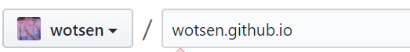

# 搭建`hexo`博客

## 安装

```shell
cnpm install -g hexo-cli
mkdir blog && cd blog
hexo init # 初始化
hexo server # -p80可以指定80端口
```

之后可以看到：

```shell
INFO  Start processing
INFO  Hexo is running at http://localhost:4000 . Press Ctrl+C to stop.
```

打开浏览器`http://localhost:4000`即可。

## 托管到`github`

`github`上创建厂库，比如我的`wotsen.github.io`。



配置`blog`下的`_config.yml`：

```shell
➜  blog ls
_config.yml  db.json  node_modules  package.json  public  scaffolds  source  themes
```


```yml
deploy:
  type: git
  repository: https://github.com/wotsen/wotsen.github.io   //将地址换成自己的
  branch: master
```

推送到`github`

```shell
cnpm install hexo-deployer-git --save
hexo g  #（本地生成静态文件）
hexo d  #（将本地静态文件推送至Github）
```

打开`http://wotsen.github.io`可看到。

## 更换主题

可以在官网或者`github`上去找主题。比如：`<https://github.com/MOxFIVE/hexo-theme-yelee>`

根据说明，首先拉取：

```shell
git clone https://github.com/MOxFIVE/hexo-theme-yelee.git themes/yelee
```

在修改本地`_config.yml`文件，选择语言和主题：

```yml
theme: yelee
language: en
```

其他的主题配置查看`themes/yelee`下的`_config.yml`文件即可。

## 部分配置

修改路径：

```shell
## If your site is put in a subdirectory, set url as 'http://luuman.github.io/child' and root as '/child/'
url: http://wotsen.github.io/Blog
root: /Blog/
# url: http://wotsen.github.io
# root: /
```

语言：

```yml
language: zh-Hans
```

在导航栏添加点东西

- 例如我添加了一个更新日志的模块。
- 在主题的配置文件中，menu添加一栏：`Board: /board`。
- 然后在source中添加一个board，即对应上面的名字。然后再创建一个index.md，里面可以写你想写的内容。
- 在主题的`yelee/langulages/zh-Hans.yml`中的index适当的位置加：`board: '更新日志'`，位置和名字是你自己设定。
- 重新部署，然后就OK了

## 写文章部分

- 新建文章：`hexo new '文章名'`，然后你就可以在`source/_posts`路径下看到你创建的文章啦，编辑完成之后按照前面说的方式部署，在浏览器刷新就能看到你的文章了。
- 关于具体的文章编辑你可以看下[官网的介绍](https://hexo.io/zh-cn/docs/writing.html)
- 至于markdown，可以自行发挥啦~

## 部署到nginx

