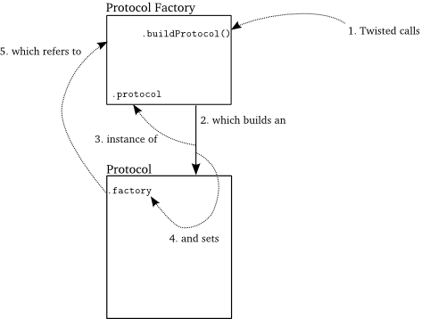

# `twisted`学习总结

[官网](https://twistedmatrix.com/documents/current/core/howto/reactor-basics.html)

[github](https://github.com/twisted/twisted)

`twisted`是一个异步网络框架，基于事件循环，支持许多底层网络协议，高效。

## 1. 原理

### 1.1 `reactor`简单介绍

它的核心称为`reactor`反应堆模式:


与`select`类似，在`loop`当中监视所有的可用事件，存在可用事件即可调用，如果某些事件处于阻塞(`I/O`)，则跳过等待。

简单示例`src/simple.py`:

```python
from twisted.internet import reactor
reactor.run()
```

第一行引入了`reactor`，第二行开始启动事件循环，事件循环则是`twisted`核心。

值得注意的是，这里并不是一个在不停运行的简单循环。如果你在桌面上有个CPU性能查看器，可以发现这个循环体不会带来任何性能损失，`reactor`一直处于`wait for events`状态，由于没有添加事件，所以永远不会有事件到来。

总结以下几点:

1. `Twisted`的`reactor`只有通过调用`reactor.run()`才启动。
2. `reactor`循环是在其开始的线程中运行，也就是运行在主线程中。
3. 一旦启动，reactor就会在程序的控制下（或者具体在一个启动它的线程的控制下）一直运行下去。
4. `reactor`空转时并不会消耗任何`CPU`的资源。
5. 并不需要显式的创建`reactor`，只需要引入就`OK`了。

**`reactor`是一个单例模式，一个程序只能引入一个。**

### 1.2 简单应用

`src/helloworld.py`:

```python
def hello():
    print('Hello from the reactor loop!')
    print('Lately I feel like I\'m stuck in a rut.')

from twisted.internet import reactor 

reactor.callWhenRunning(hello)
print('Starting the reactor.')
reactor.run()
```

输出:

```shell
Starting the reactor. 
Hello from the reactor loop!
Lately I feel like I'm stuck in a rut.
```

- `hello`函数是在`run`之后打印的，说明该函数由`reactor`进行调度；
- `callWhenRunning`用于添加一个事件，而这个事件就是一个回调函数，表明要在`reactor`启动时运行它；
- **`reactor`核心与业务代码进行交互都是通过回调函数的方式进行的**

所以：

1. `reactor`模式是单线程的。
2. 像`Twisted`这种交互式模型已经实现了`reactor`循环，意味无需我们亲自去实现它。
3. 我们仍然需要框架来调用我们自己的代码来完成业务逻辑。
4. 因为在单线程中运行，要想跑我们自己的代码，必须在`reactor`循环中调用它们。
5. `reactor`事先并不知道调用我们代码的哪个函数


这个图可以十分简单描述这个过程，上边是`twisted`核心，下方是业务代码，我们注册事件，而`twisted`则负责监听事件，在合适的时候调用我们注册的事件。

1. 我们的代码与Twisted代码运行在同一个线程中。
2. 当我们的代码运行时，Twisted代码是处于暂停状态的。
3. 同样，当Twisted代码处于运行状态时，我们的代码处于暂停状态。
4. reactor事件循环会在我们的回调函数返回后恢复运行。

由于`twisted`是单线程非阻塞的，在调用回调函数时会阻塞在我们的接口上，所以我们的回调接口函数应当快速返回，否则人然回造成其他事件的调用。

### 1.3 关闭`reactor`

`src/countdown.py`:

```python
class Countdown(object):

    counter = 5

    def count(self):
        if self.counter == 0:
            reactor.stop()
        else:
            print(self.counter, '...')
            self.counter -= 1
            reactor.callLater(1, self.count)

from twisted.internet import reactor

reactor.callWhenRunning(Countdown().count)

print('Start!')
reactor.run()
print('Stop!')
```

可以通过`reactor.stop()`来关闭`reactor`，但是一旦关闭则无法启动，此时程序已经结束了。

`callLater`函数为Twisted注册了一个回调函数。`callLater`中的第二个参数是回调函数，第一个则是说明你希望在将来几秒钟时执行你的回调函数。

另外如果我们的回调接口跑出异常，这并不会导致`reactor`崩溃，能够很好地从我们的回调接口中返回继续执行下一个事件。

## 调度器

### `IReactorTime`

和时间相关的接口`twisted.internet.interfaces.IReactorTime(Interface)`：

| Method | [seconds](https://twistedmatrix.com/documents/19.10.0/api/twisted.internet.interfaces.IReactorTime.html#seconds) | 返回当前时间秒                                           |
| ------ | ------------------------------------------------------------ | -------------------------------------------------------- |
| Method | [callLater](https://twistedmatrix.com/documents/19.10.0/api/twisted.internet.interfaces.IReactorTime.html#callLater) | 一定时间后调用函数接口，时间单位是秒，支持小数           |
| Method | [getDelayedCalls](https://twistedmatrix.com/documents/19.10.0/api/twisted.internet.interfaces.IReactorTime.html#getDelayedCalls) | 检索所有当前计划的延迟呼叫，返回的是没有调用也没有取消的 |


原型如下:

```python
class IReactorTime(Interface):
    """
    Time methods that a Reactor should implement.
    """

    def seconds():
        """
        Get the current time in seconds.
        @return: A number-like object of some sort.
        """


    def callLater(delay, callable, *args, **kw):
        """
        Call a function later.
        @type delay:  C{float}
        @param delay: the number of seconds to wait.
        @param callable: the callable object to call later.
        @param args: the arguments to call it with.
        @param kw: the keyword arguments to call it with.
        @return: An object which provides L{IDelayedCall} and can be used to
                 cancel the scheduled call, by calling its C{cancel()} method.
                 It also may be rescheduled by calling its C{delay()} or
                 C{reset()} methods.
        """


    def getDelayedCalls():
        """
        Retrieve all currently scheduled delayed calls.
        @return: A list of L{IDelayedCall} providers representing all
                 currently scheduled calls. This is everything that has been
                 returned by C{callLater} but not yet called or cancelled.
        """
```

返回对象`twisted.internet.interfaces.IDelayedCall(Interface)`:

| Method | [getTime](https://twistedmatrix.com/documents/19.10.0/api/twisted.internet.interfaces.IDelayedCall.html#getTime) | Get time when delayed call will happen. |
| ------ | ------------------------------------------------------------ | --------------------------------------- |
| Method | [cancel](https://twistedmatrix.com/documents/19.10.0/api/twisted.internet.interfaces.IDelayedCall.html#cancel) | Cancel the scheduled call.              |
| Method | [delay](https://twistedmatrix.com/documents/19.10.0/api/twisted.internet.interfaces.IDelayedCall.html#delay) | Delay the scheduled call.               |
| Method | [reset](https://twistedmatrix.com/documents/19.10.0/api/twisted.internet.interfaces.IDelayedCall.html#reset) | Reset the scheduled call's timer.       |
| Method | [active](https://twistedmatrix.com/documents/19.10.0/api/twisted.internet.interfaces.IDelayedCall.html#active) |                                         |

示例:

```python
from twisted.internet import reactor

def f(s):
    print("this will run 3.5 seconds after it was scheduled: %s" % s)

reactor.callLater(3.5, f, "hello, world")

# f() will only be called if the event loop is started.
reactor.run()
```

```python
from twisted.internet import reactor

def f():
    print("I'll never run.")

callID = reactor.callLater(5, f)
callID.cancel()
reactor.run()
```


### `twisted.internet.task.deferLater`

如果要处理注册的回调接口的结果或者处理出错，可以使用它:

```python
def deferLater(clock, delay, callable=None, *args, **kw):
    """
    Call the given function after a certain period of time has passed.
    @type clock: L{IReactorTime} provider
    @param clock: The object which will be used to schedule the delayed
        call.
    @type delay: C{float} or C{int}
    @param delay: The number of seconds to wait before calling the function.
    @param callable: The object to call after the delay.
    @param *args: The positional arguments to pass to C{callable}.
    @param **kw: The keyword arguments to pass to C{callable}.
    @rtype: L{defer.Deferred}
    @return: A deferred that fires with the result of the callable when the
        specified time has elapsed.
    """
    def deferLaterCancel(deferred):
        delayedCall.cancel()
    d = defer.Deferred(deferLaterCancel)
    if callable is not None:
        d.addCallback(lambda ignored: callable(*args, **kw))
    delayedCall = clock.callLater(delay, d.callback, None)
    return d
```

可以看到它返回了一个`Deferred`实例，可以用他添加后续处理，而最开始注册的回调接口部受影响。

```python
from twisted.internet import task
from twisted.internet import reactor

def f(s):
    return "This will run 3.5 seconds after it was scheduled: %s" % s

d = task.deferLater(reactor, 3.5, f, "hello, world")

# 在f()调用结束后调用
def called(result):
    print(result)

d.addCallback(called)

# f() will only be called if the event loop is started.
reactor.run()
```

### `twisted.internet.task.LoopingCall`

如果要循环调用，那么可以使用它，并且和前面的一样，他返回一个`Deferred`实例:

| Instance Variable | [f](https://twistedmatrix.com/documents/19.10.0/api/twisted.internet.task.LoopingCall.html#f) | The function to call.                                        |
| ----------------- | ------------------------------------------------------------ | ------------------------------------------------------------ |
| Instance Variable | [a](https://twistedmatrix.com/documents/19.10.0/api/twisted.internet.task.LoopingCall.html#a) | A tuple of arguments to pass the function.                   |
| Instance Variable | [kw](https://twistedmatrix.com/documents/19.10.0/api/twisted.internet.task.LoopingCall.html#kw) | A dictionary of keyword arguments to pass to the function.   |
| Instance Variable | [clock](https://twistedmatrix.com/documents/19.10.0/api/twisted.internet.task.LoopingCall.html#clock) | A provider of [`twisted.internet.interfaces.IReactorTime`](https://twistedmatrix.com/documents/19.10.0/api/twisted.internet.interfaces.IReactorTime.html). The default is [`twisted.internet.reactor`](https://twistedmatrix.com/documents/19.10.0/api/twisted.internet.reactor.html). Feel free to set this to something else, but it probably ought to be set *before* calling [`start`](https://twistedmatrix.com/documents/19.10.0/api/twisted.internet.task.LoopingCall.html#start). |
| Instance Variable | [running](https://twistedmatrix.com/documents/19.10.0/api/twisted.internet.task.LoopingCall.html#running) | A flag which is `True` while `f` is scheduled to be called (or is currently being called). It is set to `True` when [`start`](https://twistedmatrix.com/documents/19.10.0/api/twisted.internet.task.LoopingCall.html#start) is called and set to `False` when [`stop`](https://twistedmatrix.com/documents/19.10.0/api/twisted.internet.task.LoopingCall.html#stop) is called or if `f` raises an exception. In either case, it will be `False` by the time the `Deferred` returned by [`start`](https://twistedmatrix.com/documents/19.10.0/api/twisted.internet.task.LoopingCall.html#start) fires its callback or errback. (type: `bool`) |
| Method            | [__init__](https://twistedmatrix.com/documents/19.10.0/api/twisted.internet.task.LoopingCall.html#__init__) | *Undocumented*                                               |
| Method            | [deferred](https://twistedmatrix.com/documents/19.10.0/api/twisted.internet.task.LoopingCall.html#deferred) | DEPRECATED. [`Deferred`](https://twistedmatrix.com/documents/19.10.0/api/twisted.internet.defer.Deferred.html) fired when loop stops or fails. |
| Class Method      | [withCount](https://twistedmatrix.com/documents/19.10.0/api/twisted.internet.task.LoopingCall.html#withCount) | An alternate constructor for [`LoopingCall`](https://twistedmatrix.com/documents/19.10.0/api/twisted.internet.task.LoopingCall.html) that makes available the number of calls which should have occurred since it was last invoked. |
| Method            | [start](https://twistedmatrix.com/documents/19.10.0/api/twisted.internet.task.LoopingCall.html#start) | Start running function every interval seconds.               |
| Method            | [stop](https://twistedmatrix.com/documents/19.10.0/api/twisted.internet.task.LoopingCall.html#stop) | Stop running function.                                       |
| Method            | [reset](https://twistedmatrix.com/documents/19.10.0/api/twisted.internet.task.LoopingCall.html#reset) | Skip the next iteration and reset the timer.                 |
| Method            | [__call__](https://twistedmatrix.com/documents/19.10.0/api/twisted.internet.task.LoopingCall.html#__call__) | *Undocumented*                                               |
| Method            | [__repr__](https://twistedmatrix.com/documents/19.10.0/api/twisted.internet.task.LoopingCall.html#__repr__) | *Undocumented*                                               |

原型:

```python
class LoopingCall:
    """Call a function repeatedly.
    If C{f} returns a deferred, rescheduling will not take place until the
    deferred has fired. The result value is ignored.
    @ivar f: The function to call.
    @ivar a: A tuple of arguments to pass the function.
    @ivar kw: A dictionary of keyword arguments to pass to the function.
    @ivar clock: A provider of
        L{twisted.internet.interfaces.IReactorTime}.  The default is
        L{twisted.internet.reactor}. Feel free to set this to
        something else, but it probably ought to be set *before*
        calling L{start}.
    @type running: C{bool}
    @ivar running: A flag which is C{True} while C{f} is scheduled to be called
        (or is currently being called). It is set to C{True} when L{start} is
        called and set to C{False} when L{stop} is called or if C{f} raises an
        exception. In either case, it will be C{False} by the time the
        C{Deferred} returned by L{start} fires its callback or errback.
    @type _realLastTime: C{float}
    @ivar _realLastTime: When counting skips, the time at which the skip
        counter was last invoked.
    @type _runAtStart: C{bool}
    @ivar _runAtStart: A flag indicating whether the 'now' argument was passed
        to L{LoopingCall.start}.
    """

    call = None
    running = False
    _deferred = None
    interval = None
    _runAtStart = False
    starttime = None

    def __init__(self, f, *a, **kw):
        self.f = f
        self.a = a
        self.kw = kw
        from twisted.internet import reactor
        self.clock = reactor

    @property
    def deferred(self):
        """
        DEPRECATED. L{Deferred} fired when loop stops or fails.
        Use the L{Deferred} returned by L{LoopingCall.start}.
        """
        warningString = _getDeprecationWarningString(
            "twisted.internet.task.LoopingCall.deferred",
            Version("Twisted", 16, 0, 0),
            replacement='the deferred returned by start()')
        warnings.warn(warningString, DeprecationWarning, stacklevel=2)

        return self._deferred

    def withCount(cls, countCallable):
        """
        An alternate constructor for L{LoopingCall} that makes available the
        number of calls which should have occurred since it was last invoked.
        Note that this number is an C{int} value; It represents the discrete
        number of calls that should have been made.  For example, if you are
        using a looping call to display an animation with discrete frames, this
        number would be the number of frames to advance.
        The count is normally 1, but can be higher. For example, if the reactor
        is blocked and takes too long to invoke the L{LoopingCall}, a Deferred
        returned from a previous call is not fired before an interval has
        elapsed, or if the callable itself blocks for longer than an interval,
        preventing I{itself} from being called.
        When running with an interval if 0, count will be always 1.
        @param countCallable: A callable that will be invoked each time the
            resulting LoopingCall is run, with an integer specifying the number
            of calls that should have been invoked.
        @type countCallable: 1-argument callable which takes an C{int}
        @return: An instance of L{LoopingCall} with call counting enabled,
            which provides the count as the first positional argument.
        @rtype: L{LoopingCall}
        @since: 9.0
        """

        def counter():
            now = self.clock.seconds()

            if self.interval == 0:
                self._realLastTime = now
                return countCallable(1)

            lastTime = self._realLastTime
            if lastTime is None:
                lastTime = self.starttime
                if self._runAtStart:
                    lastTime -= self.interval
            lastInterval = self._intervalOf(lastTime)
            thisInterval = self._intervalOf(now)
            count = thisInterval - lastInterval
            if count > 0:
                self._realLastTime = now
                return countCallable(count)

        self = cls(counter)

        self._realLastTime = None

        return self

    withCount = classmethod(withCount)


    def _intervalOf(self, t):
        """
        Determine the number of intervals passed as of the given point in
        time.
        @param t: The specified time (from the start of the L{LoopingCall}) to
            be measured in intervals
        @return: The C{int} number of intervals which have passed as of the
            given point in time.
        """
        elapsedTime = t - self.starttime
        intervalNum = int(elapsedTime / self.interval)
        return intervalNum


    def start(self, interval, now=True):
        """
        Start running function every interval seconds.
        @param interval: The number of seconds between calls.  May be
        less than one.  Precision will depend on the underlying
        platform, the available hardware, and the load on the system.
        @param now: If True, run this call right now.  Otherwise, wait
        until the interval has elapsed before beginning.
        @return: A Deferred whose callback will be invoked with
        C{self} when C{self.stop} is called, or whose errback will be
        invoked when the function raises an exception or returned a
        deferred that has its errback invoked.
        """
        assert not self.running, ("Tried to start an already running "
                                  "LoopingCall.")
        if interval < 0:
            raise ValueError("interval must be >= 0")
        self.running = True
        # Loop might fail to start and then self._deferred will be cleared.
        # This why the local C{deferred} variable is used.
        deferred = self._deferred = defer.Deferred()
        self.starttime = self.clock.seconds()
        self.interval = interval
        self._runAtStart = now
        if now:
            self()
        else:
            self._scheduleFrom(self.starttime)
        return deferred

    def stop(self):
        """Stop running function.
        """
        assert self.running, ("Tried to stop a LoopingCall that was "
                              "not running.")
        self.running = False
        if self.call is not None:
            self.call.cancel()
            self.call = None
            d, self._deferred = self._deferred, None
            d.callback(self)

    def reset(self):
        """
        Skip the next iteration and reset the timer.
        @since: 11.1
        """
        assert self.running, ("Tried to reset a LoopingCall that was "
                              "not running.")
        if self.call is not None:
            self.call.cancel()
            self.call = None
            self.starttime = self.clock.seconds()
            self._scheduleFrom(self.starttime)

    def __call__(self):
        def cb(result):
            if self.running:
                self._scheduleFrom(self.clock.seconds())
            else:
                d, self._deferred = self._deferred, None
                d.callback(self)

        def eb(failure):
            self.running = False
            d, self._deferred = self._deferred, None
            d.errback(failure)

        self.call = None
        d = defer.maybeDeferred(self.f, *self.a, **self.kw)
        d.addCallback(cb)
        d.addErrback(eb)


    def _scheduleFrom(self, when):
        """
        Schedule the next iteration of this looping call.
        @param when: The present time from whence the call is scheduled.
        """
        def howLong():
            # How long should it take until the next invocation of our
            # callable?  Split out into a function because there are multiple
            # places we want to 'return' out of this.
            if self.interval == 0:
                # If the interval is 0, just go as fast as possible, always
                # return zero, call ourselves ASAP.
                return 0
            # Compute the time until the next interval; how long has this call
            # been running for?
            runningFor = when - self.starttime
            # And based on that start time, when does the current interval end?
            untilNextInterval = self.interval - (runningFor % self.interval)
            # Now that we know how long it would be, we have to tell if the
            # number is effectively zero.  However, we can't just test against
            # zero.  If a number with a small exponent is added to a number
            # with a large exponent, it may be so small that the digits just
            # fall off the end, which means that adding the increment makes no
            # difference; it's time to tick over into the next interval.
            if when == when + untilNextInterval:
                # If it's effectively zero, then we need to add another
                # interval.
                return self.interval
            # Finally, if everything else is normal, we just return the
            # computed delay.
            return untilNextInterval
        self.call = self.clock.callLater(howLong(), self)


    def __repr__(self):
        if hasattr(self.f, '__qualname__'):
            func = self.f.__qualname__
        elif hasattr(self.f, '__name__'):
            func = self.f.__name__
            if hasattr(self.f, 'im_class'):
                func = self.f.im_class.__name__ + '.' + func
        else:
            func = reflect.safe_repr(self.f)

        return 'LoopingCall<%r>(%s, *%s, **%s)' % (
            self.interval, func, reflect.safe_repr(self.a),
            reflect.safe_repr(self.kw))
```

示例：

```python
from twisted.internet import task
from twisted.internet import reactor

loopTimes = 3
failInTheEnd = False
_loopCounter = 0

def runEverySecond():
    """
    Called at ever loop interval.
    """
    global _loopCounter

    if _loopCounter < loopTimes:
        _loopCounter += 1
        print('A new second has passed.')
        return

    if failInTheEnd:
        raise Exception('Failure during loop execution.')

    # We looped enough times.
    loop.stop()
    return


def cbLoopDone(result):
    """
    Called when loop was stopped with success.
    """
    print("Loop done.")
    reactor.stop()


def ebLoopFailed(failure):
    """
    Called when loop execution failed.
    """
    print(failure.getBriefTraceback())
    reactor.stop()


loop = task.LoopingCall(runEverySecond)

# Start looping every 1 second.
loopDeferred = loop.start(1.0)

# Add callbacks for stop and failure.
loopDeferred.addCallback(cbLoopDone)
loopDeferred.addErrback(ebLoopFailed)

```

## `Deferred`

翻译过来是延期的，`twisted`用它来管理回调链。

一个Deferred有一对回调链，一个是为针对正确结果，另一个针对错误结果。新创建的Deferred的这两条链是空的。我们可以向两条链里分别添加`callback`与`errback`。其后，就可以用正确的结果或异常来激活Deferred。

- 激活Deferred意味着以我们添加的顺序激活`callback`或`errback`，回调链的执行也是按照先后顺序进行的，每个回调函数的结果都是向后传递的，而且每个`deferred`只能激活一次。
- 添加到deferred中的回调函数只携带一个参数，正确的结果或出错信息。其实，deferred支持回调函数可以有多个参数，但至少得有一个参数并且第一个只能是正确的结果或错误信息。


由于`defered`中不使用reactor，所以使用它并不需要启动事件循环。

```python
from twisted.internet.defer import Deferred

def got_poem(res):
    print('Your poem is served:')
    print(res)

def poem_failed(err):
    print('No poetry for you.')

d = Deferred()

# add a callback/errback pair to the chain
d.addCallbacks(got_poem, poem_failed)

# fire the chain with a normal result
d.callback('This poem is short.')

print("Finished")
```

### 原型

`twisted.internet.defer.Deferred`.

| Instance Variable | [called](https://twistedmatrix.com/documents/19.10.0/api/twisted.internet.defer.Deferred.html#called) | A flag which is `False` until either `callback` or `errback` is called and afterwards always `True`. (type: [`bool`](http://docs.python.org/library/stdtypes.html#bool)) |
| ----------------- | ------------------------------------------------------------ | ------------------------------------------------------------ |
| Instance Variable | [paused](https://twistedmatrix.com/documents/19.10.0/api/twisted.internet.defer.Deferred.html#paused) | A counter of how many unmatched `pause` calls have been made on this instance. (type: [`int`](http://docs.python.org/library/stdtypes.html#int)) |
| Method            | [__init__](https://twistedmatrix.com/documents/19.10.0/api/twisted.internet.defer.Deferred.html#__init__) | Initialize a [`Deferred`](https://twistedmatrix.com/documents/19.10.0/api/twisted.internet.defer.Deferred.html). |
| Method            | [addCallbacks](https://twistedmatrix.com/documents/19.10.0/api/twisted.internet.defer.Deferred.html#addCallbacks) | 添加一对接口， 分别是callback和errback                       |
| Method            | [addCallback](https://twistedmatrix.com/documents/19.10.0/api/twisted.internet.defer.Deferred.html#addCallback) | Convenience method for adding just a callback.               |
| Method            | [addErrback](https://twistedmatrix.com/documents/19.10.0/api/twisted.internet.defer.Deferred.html#addErrback) | Convenience method for adding just an errback.               |
| Method            | [addBoth](https://twistedmatrix.com/documents/19.10.0/api/twisted.internet.defer.Deferred.html#addBoth) | Convenience method for adding a single callable as both a callback and an errback. |
| Method            | [addTimeout](https://twistedmatrix.com/documents/19.10.0/api/twisted.internet.defer.Deferred.html#addTimeout) | Time out this [`Deferred`](https://twistedmatrix.com/documents/19.10.0/api/twisted.internet.defer.Deferred.html) by scheduling it to be cancelled after `timeout` seconds. |
| Method            | [chainDeferred](https://twistedmatrix.com/documents/19.10.0/api/twisted.internet.defer.Deferred.html#chainDeferred) | Chain another [`Deferred`](https://twistedmatrix.com/documents/19.10.0/api/twisted.internet.defer.Deferred.html) to this [`Deferred`](https://twistedmatrix.com/documents/19.10.0/api/twisted.internet.defer.Deferred.html). |
| Method            | [callback](https://twistedmatrix.com/documents/19.10.0/api/twisted.internet.defer.Deferred.html#callback) | 激活`callback`这条链上的回调函数 [`Deferred`](https://twistedmatrix.com/documents/19.10.0/api/twisted.internet.defer.Deferred.html). |
| Method            | [errback](https://twistedmatrix.com/documents/19.10.0/api/twisted.internet.defer.Deferred.html#errback) | 激活`errback`这条链上的回调函数 [`Deferred`](https://twistedmatrix.com/documents/19.10.0/api/twisted.internet.defer.Deferred.html). |
| Method            | [pause](https://twistedmatrix.com/documents/19.10.0/api/twisted.internet.defer.Deferred.html#pause) | Stop processing on a [`Deferred`](https://twistedmatrix.com/documents/19.10.0/api/twisted.internet.defer.Deferred.html) until [`unpause`](https://twistedmatrix.com/documents/19.10.0/api/twisted.internet.defer.Deferred.html#unpause)() is called. |
| Method            | [unpause](https://twistedmatrix.com/documents/19.10.0/api/twisted.internet.defer.Deferred.html#unpause) | Process all callbacks made since [`pause`](https://twistedmatrix.com/documents/19.10.0/api/twisted.internet.defer.Deferred.html#pause)() was called. |
| Method            | [cancel](https://twistedmatrix.com/documents/19.10.0/api/twisted.internet.defer.Deferred.html#cancel) | 取消 [`Deferred`](https://twistedmatrix.com/documents/19.10.0/api/twisted.internet.defer.Deferred.html). |
| Method            | [__str__](https://twistedmatrix.com/documents/19.10.0/api/twisted.internet.defer.Deferred.html#__str__) | Return a string representation of this `Deferred`.           |
| Method            | [__iter__](https://twistedmatrix.com/documents/19.10.0/api/twisted.internet.defer.Deferred.html#__iter__) | *Undocumented*                                               |
| Method            | [send](https://twistedmatrix.com/documents/19.10.0/api/twisted.internet.defer.Deferred.html#send) | *Undocumented*                                               |
| Method            | [asFuture](https://twistedmatrix.com/documents/19.10.0/api/twisted.internet.defer.Deferred.html#asFuture) | Adapt a [`Deferred`](https://twistedmatrix.com/documents/19.10.0/api/twisted.internet.defer.Deferred.html) into a [`asyncio.Future`](https://docs.python.org/3/library/asyncio-future.html#asyncio.Future) which is bound to `loop`. |
| Class Method      | [fromFuture](https://twistedmatrix.com/documents/19.10.0/api/twisted.internet.defer.Deferred.html#fromFuture) | Adapt an [`asyncio.Future`](https://docs.python.org/3/library/asyncio-future.html#asyncio.Future) to a [`Deferred`](https://twistedmatrix.com/documents/19.10.0/api/twisted.internet.defer.Deferred.html). |

原型：

```python
class Deferred:
    """
    This is a callback which will be put off until later.
    Why do we want this? Well, in cases where a function in a threaded
    program would block until it gets a result, for Twisted it should
    not block. Instead, it should return a L{Deferred}.
    This can be implemented for protocols that run over the network by
    writing an asynchronous protocol for L{twisted.internet}. For methods
    that come from outside packages that are not under our control, we use
    threads (see for example L{twisted.enterprise.adbapi}).
    For more information about Deferreds, see doc/core/howto/defer.html or
    U{http://twistedmatrix.com/documents/current/core/howto/defer.html}
    When creating a Deferred, you may provide a canceller function, which
    will be called by d.cancel() to let you do any clean-up necessary if the
    user decides not to wait for the deferred to complete.
    @ivar called: A flag which is C{False} until either C{callback} or
        C{errback} is called and afterwards always C{True}.
    @type called: L{bool}
    @ivar paused: A counter of how many unmatched C{pause} calls have been made
        on this instance.
    @type paused: L{int}
    @ivar _suppressAlreadyCalled: A flag used by the cancellation mechanism
        which is C{True} if the Deferred has no canceller and has been
        cancelled, C{False} otherwise.  If C{True}, it can be expected that
        C{callback} or C{errback} will eventually be called and the result
        should be silently discarded.
    @type _suppressAlreadyCalled: L{bool}
    @ivar _runningCallbacks: A flag which is C{True} while this instance is
        executing its callback chain, used to stop recursive execution of
        L{_runCallbacks}
    @type _runningCallbacks: L{bool}
    @ivar _chainedTo: If this L{Deferred} is waiting for the result of another
        L{Deferred}, this is a reference to the other Deferred.  Otherwise,
        L{None}.
    """

    called = False
    paused = False
    _debugInfo = None
    _suppressAlreadyCalled = False

    # Are we currently running a user-installed callback?  Meant to prevent
    # recursive running of callbacks when a reentrant call to add a callback is
    # used.
    _runningCallbacks = False

    # Keep this class attribute for now, for compatibility with code that
    # sets it directly.
    debug = False

    _chainedTo = None

    def __init__(self, canceller=None):
        """
        Initialize a L{Deferred}.
        @param canceller: a callable used to stop the pending operation
            scheduled by this L{Deferred} when L{Deferred.cancel} is
            invoked. The canceller will be passed the deferred whose
            cancelation is requested (i.e., self).
            If a canceller is not given, or does not invoke its argument's
            C{callback} or C{errback} method, L{Deferred.cancel} will
            invoke L{Deferred.errback} with a L{CancelledError}.
            Note that if a canceller is not given, C{callback} or
            C{errback} may still be invoked exactly once, even though
            defer.py will have already invoked C{errback}, as described
            above.  This allows clients of code which returns a L{Deferred}
            to cancel it without requiring the L{Deferred} instantiator to
            provide any specific implementation support for cancellation.
            New in 10.1.
        @type canceller: a 1-argument callable which takes a L{Deferred}. The
            return result is ignored.
        """
        self.callbacks = []
        self._canceller = canceller
        if self.debug:
            self._debugInfo = DebugInfo()
            self._debugInfo.creator = traceback.format_stack()[:-1]


    def addCallbacks(self, callback, errback=None,
                     callbackArgs=None, callbackKeywords=None,
                     errbackArgs=None, errbackKeywords=None):
        """
        Add a pair of callbacks (success and error) to this L{Deferred}.
        These will be executed when the 'master' callback is run.
        @return: C{self}.
        @rtype: a L{Deferred}
        """
        assert callable(callback)
        assert errback is None or callable(errback)
        cbs = ((callback, callbackArgs, callbackKeywords),
               (errback or (passthru), errbackArgs, errbackKeywords))
        self.callbacks.append(cbs)

        if self.called:
            self._runCallbacks()
        return self


    def addCallback(self, callback, *args, **kw):
        """
        Convenience method for adding just a callback.
        See L{addCallbacks}.
        """
        return self.addCallbacks(callback, callbackArgs=args,
                                 callbackKeywords=kw)


    def addErrback(self, errback, *args, **kw):
        """
        Convenience method for adding just an errback.
        See L{addCallbacks}.
        """
        return self.addCallbacks(passthru, errback,
                                 errbackArgs=args,
                                 errbackKeywords=kw)


    def addBoth(self, callback, *args, **kw):
        """
        Convenience method for adding a single callable as both a callback
        and an errback.
        See L{addCallbacks}.
        """
        return self.addCallbacks(callback, callback,
                                 callbackArgs=args, errbackArgs=args,
                                 callbackKeywords=kw, errbackKeywords=kw)


    def addTimeout(self, timeout, clock, onTimeoutCancel=None):
        """
        Time out this L{Deferred} by scheduling it to be cancelled after
        C{timeout} seconds.
        The timeout encompasses all the callbacks and errbacks added to this
        L{defer.Deferred} before the call to L{addTimeout}, and none added
        after the call.
        If this L{Deferred} gets timed out, it errbacks with a L{TimeoutError},
        unless a cancelable function was passed to its initialization or unless
        a different C{onTimeoutCancel} callable is provided.
        @param timeout: number of seconds to wait before timing out this
            L{Deferred}
        @type timeout: L{int}
        @param clock: The object which will be used to schedule the timeout.
        @type clock: L{twisted.internet.interfaces.IReactorTime}
        @param onTimeoutCancel: A callable which is called immediately after
            this L{Deferred} times out, and not if this L{Deferred} is
            otherwise cancelled before the timeout. It takes an arbitrary
            value, which is the value of this L{Deferred} at that exact point
            in time (probably a L{CancelledError} L{Failure}), and the
            C{timeout}.  The default callable (if none is provided) will
            translate a L{CancelledError} L{Failure} into a L{TimeoutError}.
        @type onTimeoutCancel: L{callable}
        @return: C{self}.
        @rtype: a L{Deferred}
        @since: 16.5
        """
        timedOut = [False]

        def timeItOut():
            timedOut[0] = True
            self.cancel()

        delayedCall = clock.callLater(timeout, timeItOut)

        def convertCancelled(value):
            # if C{deferred} was timed out, call the translation function,
            # if provdied, otherwise just use L{cancelledToTimedOutError}
            if timedOut[0]:
                toCall = onTimeoutCancel or _cancelledToTimedOutError
                return toCall(value, timeout)
            return value

        self.addBoth(convertCancelled)

        def cancelTimeout(result):
            # stop the pending call to cancel the deferred if it's been fired
            if delayedCall.active():
                delayedCall.cancel()
            return result

        self.addBoth(cancelTimeout)
        return self


    def chainDeferred(self, d):
        """
        Chain another L{Deferred} to this L{Deferred}.
        This method adds callbacks to this L{Deferred} to call C{d}'s callback
        or errback, as appropriate. It is merely a shorthand way of performing
        the following::
            self.addCallbacks(d.callback, d.errback)
        When you chain a deferred d2 to another deferred d1 with
        d1.chainDeferred(d2), you are making d2 participate in the callback
        chain of d1. Thus any event that fires d1 will also fire d2.
        However, the converse is B{not} true; if d2 is fired d1 will not be
        affected.
        Note that unlike the case where chaining is caused by a L{Deferred}
        being returned from a callback, it is possible to cause the call
        stack size limit to be exceeded by chaining many L{Deferred}s
        together with C{chainDeferred}.
        @return: C{self}.
        @rtype: a L{Deferred}
        """
        d._chainedTo = self
        return self.addCallbacks(d.callback, d.errback)


    def callback(self, result):
        """
        Run all success callbacks that have been added to this L{Deferred}.
        Each callback will have its result passed as the first argument to
        the next; this way, the callbacks act as a 'processing chain'.  If
        the success-callback returns a L{Failure} or raises an L{Exception},
        processing will continue on the *error* callback chain.  If a
        callback (or errback) returns another L{Deferred}, this L{Deferred}
        will be chained to it (and further callbacks will not run until that
        L{Deferred} has a result).
        An instance of L{Deferred} may only have either L{callback} or
        L{errback} called on it, and only once.
        @param result: The object which will be passed to the first callback
            added to this L{Deferred} (via L{addCallback}).
        @raise AlreadyCalledError: If L{callback} or L{errback} has already been
            called on this L{Deferred}.
        """
        assert not isinstance(result, Deferred)
        self._startRunCallbacks(result)


    def errback(self, fail=None):
        """
        Run all error callbacks that have been added to this L{Deferred}.
        Each callback will have its result passed as the first
        argument to the next; this way, the callbacks act as a
        'processing chain'. Also, if the error-callback returns a non-Failure
        or doesn't raise an L{Exception}, processing will continue on the
        *success*-callback chain.
        If the argument that's passed to me is not a L{failure.Failure} instance,
        it will be embedded in one. If no argument is passed, a
        L{failure.Failure} instance will be created based on the current
        traceback stack.
        Passing a string as `fail' is deprecated, and will be punished with
        a warning message.
        An instance of L{Deferred} may only have either L{callback} or
        L{errback} called on it, and only once.
        @param fail: The L{Failure} object which will be passed to the first
            errback added to this L{Deferred} (via L{addErrback}).
            Alternatively, a L{Exception} instance from which a L{Failure} will
            be constructed (with no traceback) or L{None} to create a L{Failure}
            instance from the current exception state (with a traceback).
        @raise AlreadyCalledError: If L{callback} or L{errback} has already been
            called on this L{Deferred}.
        @raise NoCurrentExceptionError: If C{fail} is L{None} but there is
            no current exception state.
        """
        if fail is None:
            fail = failure.Failure(captureVars=self.debug)
        elif not isinstance(fail, failure.Failure):
            fail = failure.Failure(fail)

        self._startRunCallbacks(fail)


    def pause(self):
        """
        Stop processing on a L{Deferred} until L{unpause}() is called.
        """
        self.paused = self.paused + 1


    def unpause(self):
        """
        Process all callbacks made since L{pause}() was called.
        """
        self.paused = self.paused - 1
        if self.paused:
            return
        if self.called:
            self._runCallbacks()


    def cancel(self):
        """
        Cancel this L{Deferred}.
        If the L{Deferred} has not yet had its C{errback} or C{callback} method
        invoked, call the canceller function provided to the constructor. If
        that function does not invoke C{callback} or C{errback}, or if no
        canceller function was provided, errback with L{CancelledError}.
        If this L{Deferred} is waiting on another L{Deferred}, forward the
        cancellation to the other L{Deferred}.
        """
        if not self.called:
            canceller = self._canceller
            if canceller:
                canceller(self)
            else:
                # Arrange to eat the callback that will eventually be fired
                # since there was no real canceller.
                self._suppressAlreadyCalled = True
            if not self.called:
                # There was no canceller, or the canceller didn't call
                # callback or errback.
                self.errback(failure.Failure(CancelledError()))
        elif isinstance(self.result, Deferred):
            # Waiting for another deferred -- cancel it instead.
            self.result.cancel()


    def _startRunCallbacks(self, result):
        if self.called:
            if self._suppressAlreadyCalled:
                self._suppressAlreadyCalled = False
                return
            if self.debug:
                if self._debugInfo is None:
                    self._debugInfo = DebugInfo()
                extra = "\n" + self._debugInfo._getDebugTracebacks()
                raise AlreadyCalledError(extra)
            raise AlreadyCalledError
        if self.debug:
            if self._debugInfo is None:
                self._debugInfo = DebugInfo()
            self._debugInfo.invoker = traceback.format_stack()[:-2]
        self.called = True
        self.result = result
        self._runCallbacks()


    def _continuation(self):
        """
        Build a tuple of callback and errback with L{_CONTINUE}.
        """
        return ((_CONTINUE, (self,), None),
                (_CONTINUE, (self,), None))


    def _runCallbacks(self):
        """
        Run the chain of callbacks once a result is available.
        This consists of a simple loop over all of the callbacks, calling each
        with the current result and making the current result equal to the
        return value (or raised exception) of that call.
        If L{_runningCallbacks} is true, this loop won't run at all, since
        it is already running above us on the call stack.  If C{self.paused} is
        true, the loop also won't run, because that's what it means to be
        paused.
        The loop will terminate before processing all of the callbacks if a
        L{Deferred} without a result is encountered.
        If a L{Deferred} I{with} a result is encountered, that result is taken
        and the loop proceeds.
        @note: The implementation is complicated slightly by the fact that
            chaining (associating two L{Deferred}s with each other such that one
            will wait for the result of the other, as happens when a Deferred is
            returned from a callback on another L{Deferred}) is supported
            iteratively rather than recursively, to avoid running out of stack
            frames when processing long chains.
        """
        if self._runningCallbacks:
            # Don't recursively run callbacks
            return

        # Keep track of all the Deferreds encountered while propagating results
        # up a chain.  The way a Deferred gets onto this stack is by having
        # added its _continuation() to the callbacks list of a second Deferred
        # and then that second Deferred being fired.  ie, if ever had _chainedTo
        # set to something other than None, you might end up on this stack.
        chain = [self]

        while chain:
            current = chain[-1]

            if current.paused:
                # This Deferred isn't going to produce a result at all.  All the
                # Deferreds up the chain waiting on it will just have to...
                # wait.
                return

            finished = True
            current._chainedTo = None
            while current.callbacks:
                item = current.callbacks.pop(0)
                callback, args, kw = item[
                    isinstance(current.result, failure.Failure)]
                args = args or ()
                kw = kw or {}

                # Avoid recursion if we can.
                if callback is _CONTINUE:
                    # Give the waiting Deferred our current result and then
                    # forget about that result ourselves.
                    chainee = args[0]
                    chainee.result = current.result
                    current.result = None
                    # Making sure to update _debugInfo
                    if current._debugInfo is not None:
                        current._debugInfo.failResult = None
                    chainee.paused -= 1
                    chain.append(chainee)
                    # Delay cleaning this Deferred and popping it from the chain
                    # until after we've dealt with chainee.
                    finished = False
                    break

                try:
                    current._runningCallbacks = True
                    try:
                        current.result = callback(current.result, *args, **kw)
                        if current.result is current:
                            warnAboutFunction(
                                callback,
                                "Callback returned the Deferred "
                                "it was attached to; this breaks the "
                                "callback chain and will raise an "
                                "exception in the future.")
                    finally:
                        current._runningCallbacks = False
                except:
                    # Including full frame information in the Failure is quite
                    # expensive, so we avoid it unless self.debug is set.
                    current.result = failure.Failure(captureVars=self.debug)
                else:
                    if isinstance(current.result, Deferred):
                        # The result is another Deferred.  If it has a result,
                        # we can take it and keep going.
                        resultResult = getattr(current.result, 'result', _NO_RESULT)
                        if resultResult is _NO_RESULT or isinstance(resultResult, Deferred) or current.result.paused:
                            # Nope, it didn't.  Pause and chain.
                            current.pause()
                            current._chainedTo = current.result
                            # Note: current.result has no result, so it's not
                            # running its callbacks right now.  Therefore we can
                            # append to the callbacks list directly instead of
                            # using addCallbacks.
                            current.result.callbacks.append(current._continuation())
                            break
                        else:
                            # Yep, it did.  Steal it.
                            current.result.result = None
                            # Make sure _debugInfo's failure state is updated.
                            if current.result._debugInfo is not None:
                                current.result._debugInfo.failResult = None
                            current.result = resultResult

            if finished:
                # As much of the callback chain - perhaps all of it - as can be
                # processed right now has been.  The current Deferred is waiting on
                # another Deferred or for more callbacks.  Before finishing with it,
                # make sure its _debugInfo is in the proper state.
                if isinstance(current.result, failure.Failure):
                    # Stash the Failure in the _debugInfo for unhandled error
                    # reporting.
                    current.result.cleanFailure()
                    if current._debugInfo is None:
                        current._debugInfo = DebugInfo()
                    current._debugInfo.failResult = current.result
                else:
                    # Clear out any Failure in the _debugInfo, since the result
                    # is no longer a Failure.
                    if current._debugInfo is not None:
                        current._debugInfo.failResult = None

                # This Deferred is done, pop it from the chain and move back up
                # to the Deferred which supplied us with our result.
                chain.pop()


    def __str__(self):
        """
        Return a string representation of this C{Deferred}.
        """
        cname = self.__class__.__name__
        result = getattr(self, 'result', _NO_RESULT)
        myID = id(self)
        if self._chainedTo is not None:
            result = ' waiting on Deferred at 0x%x' % (id(self._chainedTo),)
        elif result is _NO_RESULT:
            result = ''
        else:
            result = ' current result: %r' % (result,)
        return "<%s at 0x%x%s>" % (cname, myID, result)
    __repr__ = __str__


    def __iter__(self):
        return self


    @failure._extraneous
    def send(self, value=None):
        if self.paused:
            # If we're paused, we have no result to give
            return self

        result = getattr(self, 'result', _NO_RESULT)
        if result is _NO_RESULT:
            return self
        if isinstance(result, failure.Failure):
            # Clear the failure on debugInfo so it doesn't raise "unhandled
            # exception"
            self._debugInfo.failResult = None
            result.value.__failure__ = result
            raise result.value
        else:
            raise StopIteration(result)


    # For PEP-492 support (async/await)
    __await__ = __iter__
    __next__ = send


    def asFuture(self, loop):
        """
        Adapt a L{Deferred} into a L{asyncio.Future} which is bound to C{loop}.
        @note: converting a L{Deferred} to an L{asyncio.Future} consumes both
            its result and its errors, so this method implicitly converts
            C{self} into a L{Deferred} firing with L{None}, regardless of what
            its result previously would have been.
        @since: Twisted 17.5.0
        @param loop: The asyncio event loop to bind the L{asyncio.Future} to.
        @type loop: L{asyncio.AbstractEventLoop} or similar
        @param deferred: The Deferred to adapt.
        @type deferred: L{Deferred}
        @return: A Future which will fire when the Deferred fires.
        @rtype: L{asyncio.Future}
        """
        try:
            createFuture = loop.create_future
        except AttributeError:
            from asyncio import Future
            def createFuture():
                return Future(loop=loop)
        future = createFuture()
        def checkCancel(futureAgain):
            if futureAgain.cancelled():
                self.cancel()
        def maybeFail(failure):
            if not future.cancelled():
                future.set_exception(failure.value)
        def maybeSucceed(result):
            if not future.cancelled():
                future.set_result(result)
        self.addCallbacks(maybeSucceed, maybeFail)
        future.add_done_callback(checkCancel)
        return future


    @classmethod
    def fromFuture(cls, future):
        """
        Adapt an L{asyncio.Future} to a L{Deferred}.
        @note: This creates a L{Deferred} from a L{asyncio.Future}, I{not} from
            a C{coroutine}; in other words, you will need to call
            L{asyncio.ensure_future},
            L{asyncio.loop.create_task} or create an
            L{asyncio.Task} yourself to get from a C{coroutine} to a
            L{asyncio.Future} if what you have is an awaitable coroutine and
            not a L{asyncio.Future}.  (The length of this list of techniques is
            exactly why we have left it to the caller!)
        @since: Twisted 17.5.0
        @param future: The Future to adapt.
        @type future: L{asyncio.Future}
        @return: A Deferred which will fire when the Future fires.
        @rtype: L{Deferred}
        """
        def adapt(result):
            try:
                extracted = result.result()
            except:
                extracted = failure.Failure()
            adapt.actual.callback(extracted)
        futureCancel = object()
        def cancel(reself):
            future.cancel()
            reself.callback(futureCancel)
        self = cls(cancel)
        adapt.actual = self
        def uncancel(result):
            if result is futureCancel:
                adapt.actual = Deferred()
                return adapt.actual
            return result
        self.addCallback(uncancel)
        future.add_done_callback(adapt)
        return self
```


# 2 网络基础

在我们付诸于代码前，有三个新的概念需要阐述清楚：`Transports`, `Protocols`, `Protocol Factories`

### Transports

`Transports`抽象是通过`Twisted`中`interfaces`模块中`ITransport`接口定义的。一个`Twisted`的`Transport`代表一个可以收发字节的单条连接。对于客户端而言，就是对一条TCP连接的抽象。但是`Twisted`也支持诸如`Unix`中管道和`UDP`。`Transport`抽象可以代表任何这样的连接并为其代表的连接处理具体的异步`I/O`操作细节。传输层协议。

如果你浏览一下`ITransport`中的方法，可能找不到任何接收数据的方法。这是因为`Transports`总是在低层完成从连接中异步读取数据的许多细节工作，然后通过回调将数据发给我们。相似的原理，`Transport`对象的写相关的方法为避免阻塞也不会选择立即写我们要发送的数据。告诉一个`Transport`要发送数据，只是意味着：尽快将这些数据发送出去，别产生阻塞就行。当然，数据会按照我们提交的顺序发送。

通常我们不会自己实现一个`Transport`。我们会去使用`Twisted`提供的实现类，即在传递给`reactor`时会为我们创建一个对象实例。

### Protocols

`Twisted`的`Protocols`抽象由`interfaces`模块中的`IProtocol`定义。也许你已经想到，`Protocol`对象实现协议内容。也就是说，一个具体的`Twisted`的`Protocol`的实现应该对应一个具体网络协议的实现，像`FTP`、`IMAP`或其它我们自己制定的协议。我们的简单文件下载协议，正如它表现的那样，就是在连接建立后将所有的文件内容全部发送出去并且在发送完毕后关闭连接。也就是应用层的协议

严格意义上讲，每一个Twisted的Protocols类实例都为一个具体的连接提供协议解析。因此我们的程序每建立一条连接（对于服务方就是每接受一条连接），都需要一个协议实例。这就意味着，`Protocol`实例是存储协议状态与间断性（由于我们是通过异步I/O方式以任意大小来接收数据的）接收并累积数据的地方。

因此，`Protocol`实例如何得知它为哪条连接服务呢？如果你阅读`IProtocol`定义会发现一个`makeConnection`函数。这是一个回调函数，`Twisted`会在调用它时传递给其一个也是仅有的一个参数，即`Transport`实例。这个`Transport`实例就代表`Protocol`将要使用的连接。

`Twisted`内置了很多实现了通用协议的`Protocol`。你可以在[twisted.protocols.basic](http://twistedmatrix.com/trac/browser/trunk/twisted/protocols/basic.py)中找到一些稍微简单点的。在你尝试写新`Protocol`时，最好是看看`Twisted`源码是不是已经有现成的存在。如果没有，那实现一个自己的协议是非常好的。

### Protocol Factories

因此每个连接需要一个自己的`Protocol`，而且这个`Protocol`是我们自己定义的类的实例。由于我们会将创建连接的工作交给`Twisted`来完成，`Twisted`需要一种方式来为一个新的连接创建一个合适的协议。创建协议就是`Protocol Factories`的工作了。

也许你已经猜到了，`Protocol Factory`的`API`由[IProtocolFactory](http://twistedmatrix.com/trac/browser/trunk/twisted/internet/interfaces.py)来定义，同样在[interfaces](http://twistedmatrix.com/trac/browser/trunk/twisted/internet/interfaces.py)模块中。`Protocol Factory`就是`Factory`模式的一个具体实现。`buildProtocol`方法在每次被调用时返回一个新`Protocol`实例，它就是`Twisted`用来为新连接创建新`Protocol`实例的方法。类似于设计模式中工厂模式，由工厂来产生一个具体的协议实例，而我们需要定义这个协议实例的类。

# 3.  `TCP`

## 3.1 服务器

`src/chat-srv.py`:

```python
from twisted.internet.protocol import Factory
from twisted.protocols.basic import LineReceiver
from twisted.internet import reactor

class Chat(LineReceiver):

    def __init__(self, users):
        self.users = users
        self.name = None
        self.state = "GETNAME"

    def connectionMade(self):
        self.sendLine("What's your name?")

    def connectionLost(self, reason):
        if self.name in self.users:
            del self.users[self.name]

    def lineReceived(self, line):
        if self.state == "GETNAME":
            self.handle_GETNAME(line)
        else:
            self.handle_CHAT(line)

    def handle_GETNAME(self, name):
        if name in self.users:
            self.sendLine("Name taken, please choose another.")
            return
        self.sendLine("Welcome, %s!" % (name,))
        self.name = name
        self.users[name] = self
        self.state = "CHAT"

    def handle_CHAT(self, message):
        message = "<%s> %s" % (self.name, message)
        for name, protocol in self.users.iteritems():
            if protocol != self:
                protocol.sendLine(message)


class ChatFactory(Factory):

    def __init__(self):
        self.users = {} # maps user names to Chat instances

    def buildProtocol(self, addr):
        return Chat(self.users)


reactor.listenTCP(8123, ChatFactory())
reactor.run()
```


接下来一步步作代码解析:

### 3.1.1 `reactor.listenTCP`

`reactor.listenTCP`这是一个用于创建`TCP`监听的接口，原型如下:

```python
class IReactorTCP(Interface):

    def listenTCP(port, factory, backlog=50, interface=''):
        """
        将给定的协议工厂连接到给定的TCP端口
        @param port: 要监听的端口号
        @param factory: 例如{twisted.internet.protocol.ServerFactory} 这样的一个工厂实例
        @param backlog: 监听最大最列长度
        @param interface: 本地IPV4或者IPV6地址;
            默认 '', IPv4.  
            如果IPV4和IPV6都要绑定，那么这个接口需要调用两次，绑定各自的地址
        @return: an object that provides L{IListeningPort}.
        @raise CannotListenError: as defined here
                                  L{twisted.internet.error.CannotListenError},
                                  if it cannot listen on this port (e.g., it
                                  cannot bind to the required port number)
        """
```

### 3.1.2 `class ChatFactory(Factory)`

`class ChatFactory(Factory)`工厂，继承于`Factory`，原型如下：

| Class Method | [forProtocol](https://twistedmatrix.com/documents/19.10.0/api/twisted.internet.protocol.Factory.html#forProtocol) | Create a factory for the given protocol.                     |
| ------------ | ------------------------------------------------------------ | ------------------------------------------------------------ |
| Method       | [logPrefix](https://twistedmatrix.com/documents/19.10.0/api/twisted.internet.protocol.Factory.html#logPrefix) | Describe this factory for log messages.                      |
| Method       | [doStart](https://twistedmatrix.com/documents/19.10.0/api/twisted.internet.protocol.Factory.html#doStart) | Make sure startFactory is called.                            |
| Method       | [doStop](https://twistedmatrix.com/documents/19.10.0/api/twisted.internet.protocol.Factory.html#doStop) | Make sure stopFactory is called.                             |
| Method       | [startFactory](https://twistedmatrix.com/documents/19.10.0/api/twisted.internet.protocol.Factory.html#startFactory) | This will be called before I begin listening on a Port or Connector. |
| Method       | [stopFactory](https://twistedmatrix.com/documents/19.10.0/api/twisted.internet.protocol.Factory.html#stopFactory) | This will be called before I stop listening on all Ports/Connectors. |
| Method       | [buildProtocol](https://twistedmatrix.com/documents/19.10.0/api/twisted.internet.protocol.Factory.html#buildProtocol) | 用于创建一个协议子类的实例.最重要的方法                      |

```python
class Factory:
    """
    用户创建协议实例的工厂，默认情况下，buildProtocol将创建self.protocol中给定的类的协议。
    """

    # 将协议类型放在这里:
    protocol = None

    numPorts = 0
    noisy = True

    @classmethod
    def forProtocol(cls, protocol, *args, **kwargs):
        """
        它设置 {protocol}属性并返回构造的工厂实例。
        @param protocol: A L{Protocol} 类
        @param args: Positional arguments for the factory.
        @param kwargs: Keyword arguments for the factory.
        @return: A L{Factory} instance wired up to C{protocol}.
        """
        factory = cls(*args, **kwargs)
        factory.protocol = protocol
        return factory


    def logPrefix(self):
        """
        Describe this factory for log messages.
        """
        return self.__class__.__name__


    def doStart(self):
        """
        Make sure startFactory is called.
        Users should not call this function themselves!
        """
        if not self.numPorts:
            if self.noisy:
                _loggerFor(self).info("Starting factory {factory!r}",
                                      factory=self)
            self.startFactory()
        self.numPorts = self.numPorts + 1


    def doStop(self):
        """
        Make sure stopFactory is called.
        Users should not call this function themselves!
        """
        if self.numPorts == 0:
            # This shouldn't happen, but does sometimes and this is better
            # than blowing up in assert as we did previously.
            return
        self.numPorts = self.numPorts - 1
        if not self.numPorts:
            if self.noisy:
                _loggerFor(self).info("Stopping factory {factory!r}",
                                      factory=self)
            self.stopFactory()


    def startFactory(self):
        """
        This will be called before I begin listening on a Port or Connector.
        It will only be called once, even if the factory is connected
        to multiple ports.
        This can be used to perform 'unserialization' tasks that
        are best put off until things are actually running, such
        as connecting to a database, opening files, etcetera.
        """


    def stopFactory(self):
        """
        This will be called before I stop listening on all Ports/Connectors.
        This can be overridden to perform 'shutdown' tasks such as disconnecting
        database connections, closing files, etc.
        It will be called, for example, before an application shuts down,
        if it was connected to a port. User code should not call this function
        directly.
        """


    def buildProtocol(self, addr):
        """
        创建协议的子类的实例。
		返回的实例将处理传入服务器连接上的输入，以及指向创建工厂的属性“ factory”。
        或者，可以返回L {None}以立即关闭新连接。
        Override this method to alter how Protocol instances get created.
        @param addr: an object implementing L{twisted.internet.interfaces.IAddress}
        """
        p = self.protocol()
        p.factory = self
        return p
```

可以看到在这里创建了协议类的实例:

```python
def buildProtocol(self, addr):
        return Chat(self.users)
```

在原生的`buildProtocol`中`p.factory = self`，可以发现每个协议实例的`factory`都指向工厂实例，那么如果多个由该工厂实例创建的协议实例之间可以通过它进行数据共享:

```python
_fac = ChatFactory()
reactor.listenTCP(8123, _fac)
reactor.listenTCP(8124, _fac)
reactor.listenTCP(8125, _fac)
_fac.users = ["12", "23"];

...
print(p.factory.users)

reactor.run()
```


常见的派生类:

- [twisted.conch.ssh.factory.SSHFactory](https://twistedmatrix.com/documents/19.10.0/api/twisted.conch.ssh.factory.SSHFactory.html)

- [twisted.conch.ssh.forwarding.SSHListenForwardingFactory](https://twistedmatrix.com/documents/19.10.0/api/twisted.conch.ssh.forwarding.SSHListenForwardingFactory.html)

- [twisted.internet.protocol.ClientFactory](https://twistedmatrix.com/documents/19.10.0/api/twisted.internet.protocol.ClientFactory.html)
- [twisted.internet.protocol.ServerFactory](https://twistedmatrix.com/documents/19.10.0/api/twisted.internet.protocol.ServerFactory.html)
- [twisted.protocols.portforward.ProxyFactory](https://twistedmatrix.com/documents/19.10.0/api/twisted.protocols.portforward.ProxyFactory.html)
- [twisted.protocols.socks.SOCKSv4Factory](https://twistedmatrix.com/documents/19.10.0/api/twisted.protocols.socks.SOCKSv4Factory.html)
- [twisted.protocols.socks.SOCKSv4IncomingFactory](https://twistedmatrix.com/documents/19.10.0/api/twisted.protocols.socks.SOCKSv4IncomingFactory.html)
- [twisted.web.client._HTTP11ClientFactory](https://twistedmatrix.com/documents/19.10.0/api/twisted.web.client._HTTP11ClientFactory.html)
- [twisted.words.protocols.irc.DccSendFactory](https://twistedmatrix.com/documents/19.10.0/api/twisted.words.protocols.irc.DccSendFactory.html)

### 3.1.3 `class Chat(LineReceiver)`

`class Chat(LineReceiver):`继承自`ineReceiver`，而它又继承于` [twisted.internet.protocol.Protocol](https://twistedmatrix.com/documents/19.10.0/api/twisted.internet.protocol.Protocol.html)`:

| Method | [logPrefix](https://twistedmatrix.com/documents/19.10.0/api/twisted.internet.protocol.Protocol.html#logPrefix) | Return a prefix matching the class name, to identify log messages related to this protocol instance. |
| ------ | ------------------------------------------------------------ | ------------------------------------------------------------ |
| Method | [dataReceived](https://twistedmatrix.com/documents/19.10.0/api/twisted.internet.protocol.Protocol.html#dataReceived) | 当有数据可以接受时调用.                                      |
| Method | [connectionLost](https://twistedmatrix.com/documents/19.10.0/api/twisted.internet.protocol.Protocol.html#connectionLost) | 当连接断开时调用.                                            |

继承自 [BaseProtocol](https://twistedmatrix.com/documents/19.10.0/api/twisted.internet.protocol.BaseProtocol.html)的方法:

| Method | [makeConnection](https://twistedmatrix.com/documents/19.10.0/api/twisted.internet.protocol.BaseProtocol.html#makeConnection) | 创建一个传输连接和服务器. |
| ------ | ------------------------------------------------------------ | ------------------------- |
| Method | [connectionMade](https://twistedmatrix.com/documents/19.10.0/api/twisted.internet.protocol.BaseProtocol.html#connectionMade) | 当建立连接时调用.         |

原型:

```python
class BaseProtocol:
    """
    This is the abstract superclass of all protocols.
    Some methods have helpful default implementations here so that they can
    easily be shared, but otherwise the direct subclasses of this class are more
    interesting, L{Protocol} and L{ProcessProtocol}.
    """
    connected = 0
    transport = None

    def makeConnection(self, transport):
        """
        Make a connection to a transport and a server.
        This sets the 'transport' attribute of this Protocol, and calls the
        connectionMade() callback.
        """
        self.connected = 1
        self.transport = transport
        self.connectionMade()


    def connectionMade(self):
        """
        Called when a connection is made.
        This may be considered the initializer of the protocol, because
        it is called when the connection is completed.  For clients,
        this is called once the connection to the server has been
        established; for servers, this is called after an accept() call
        stops blocking and a socket has been received.  If you need to
        send any greeting or initial message, do it here.
        """

class Protocol(BaseProtocol):
    """
    This is the base class for streaming connection-oriented protocols.
    If you are going to write a new connection-oriented protocol for Twisted,
    start here.  Any protocol implementation, either client or server, should
    be a subclass of this class.
    The API is quite simple.  Implement L{dataReceived} to handle both
    event-based and synchronous input; output can be sent through the
    'transport' attribute, which is to be an instance that implements
    L{twisted.internet.interfaces.ITransport}.  Override C{connectionLost} to be
    notified when the connection ends.
    Some subclasses exist already to help you write common types of protocols:
    see the L{twisted.protocols.basic} module for a few of them.
    """

    def logPrefix(self):
        """
        Return a prefix matching the class name, to identify log messages
        related to this protocol instance.
        """
        return self.__class__.__name__


    def dataReceived(self, data):
        """
        Called whenever data is received.
        Use this method to translate to a higher-level message.  Usually, some
        callback will be made upon the receipt of each complete protocol
        message.
        @param data: a string of indeterminate length.  Please keep in mind
            that you will probably need to buffer some data, as partial
            (or multiple) protocol messages may be received!  I recommend
            that unit tests for protocols call through to this method with
            differing chunk sizes, down to one byte at a time.
        """

    def connectionLost(self, reason=connectionDone):
        """
        Called when the connection is shut down.
        Clear any circular references here, and any external references
        to this Protocol.  The connection has been closed.
        @type reason: L{twisted.python.failure.Failure}
        """
```

说明:其中继承的`LineReceiver`也是一个子类，不过重写了`dataReceived`与`write`。

` self.transport = transport`这条语句中将传输连接复制给了`self.transport`，那么我们可以通过它来对传输连接进行底层的控制,如:

```python
from twisted.internet.protocol import Protocol

class QOTD(Protocol):

    def connectionMade(self):
        # 发送数据
        self.transport.write("An apple a day keeps the doctor away\r\n")
        # 关闭连接
        self.transport.loseConnection()
```


常见子类：

- [twisted.conch.client.agent.SSHAgentForwardingLocal](https://twistedmatrix.com/documents/19.10.0/api/twisted.conch.client.agent.SSHAgentForwardingLocal.html), 
- [twisted.conch.insults.helper.TerminalBuffer](https://twistedmatrix.com/documents/19.10.0/api/twisted.conch.insults.helper.TerminalBuffer.html), 
- [twisted.conch.insults.insults.ClientProtocol](https://twistedmatrix.com/documents/19.10.0/api/twisted.conch.insults.insults.ClientProtocol.html),
-  [twisted.conch.insults.insults.ServerProtocol](https://twistedmatrix.com/documents/19.10.0/api/twisted.conch.insults.insults.ServerProtocol.html),
-  [twisted.conch.ssh.agent.SSHAgentClient](https://twistedmatrix.com/documents/19.10.0/api/twisted.conch.ssh.agent.SSHAgentClient.html),
-  [twisted.conch.ssh.agent.SSHAgentServer](https://twistedmatrix.com/documents/19.10.0/api/twisted.conch.ssh.agent.SSHAgentServer.html),
-  [twisted.conch.ssh.filetransfer.FileTransferBase](https://twistedmatrix.com/documents/19.10.0/api/twisted.conch.ssh.filetransfer.FileTransferBase.html), [twisted.conch.ssh.forwarding.SSHForwardingClient](https://twistedmatrix.com/documents/19.10.0/api/twisted.conch.ssh.forwarding.SSHForwardingClient.html),
-  [twisted.conch.ssh.session.SSHSessionClient](https://twistedmatrix.com/documents/19.10.0/api/twisted.conch.ssh.session.SSHSessionClient.html),
-  [twisted.conch.ssh.transport.SSHTransportBase](https://twistedmatrix.com/documents/19.10.0/api/twisted.conch.ssh.transport.SSHTransportBase.html), 
- [twisted.conch.telnet.Telnet](https://twistedmatrix.com/documents/19.10.0/api/twisted.conch.telnet.Telnet.html),
-  [twisted.conch.telnet.TelnetProtocol](https://twistedmatrix.com/documents/19.10.0/api/twisted.conch.telnet.TelnetProtocol.html),
-  [twisted.internet.endpoints._WrappingProtocol](https://twistedmatrix.com/documents/19.10.0/api/twisted.internet.endpoints._WrappingProtocol.html),
-  [twisted.internet.testing.AccumulatingProtocol](https://twistedmatrix.com/documents/19.10.0/api/twisted.internet.testing.AccumulatingProtocol.html), 
- [twisted.names.dns.DNSProtocol](https://twistedmatrix.com/documents/19.10.0/api/twisted.names.dns.DNSProtocol.html),
-  [twisted.protocols.basic.IntNStringReceiver](https://twistedmatrix.com/documents/19.10.0/api/twisted.protocols.basic.IntNStringReceiver.html),
-  [twisted.protocols.basic.LineOnlyReceiver](https://twistedmatrix.com/documents/19.10.0/api/twisted.protocols.basic.LineOnlyReceiver.html),
-  [twisted.protocols.basic.LineReceiver](https://twistedmatrix.com/documents/19.10.0/api/twisted.protocols.basic.LineReceiver.html),
-  [twisted.protocols.basic.NetstringReceiver](https://twistedmatrix.com/documents/19.10.0/api/twisted.protocols.basic.NetstringReceiver.html),
-  [twisted.protocols.ftp.DTP](https://twistedmatrix.com/documents/19.10.0/api/twisted.protocols.ftp.DTP.html), [twisted.protocols.ftp.ProtocolWrapper](https://twistedmatrix.com/documents/19.10.0/api/twisted.protocols.ftp.ProtocolWrapper.html), 
- [twisted.protocols.ftp.SenderProtocol](https://twistedmatrix.com/documents/19.10.0/api/twisted.protocols.ftp.SenderProtocol.html), 
- [twisted.protocols.policies.ProtocolWrapper](https://twistedmatrix.com/documents/19.10.0/api/twisted.protocols.policies.ProtocolWrapper.html),
-  [twisted.protocols.portforward.Proxy](https://twistedmatrix.com/documents/19.10.0/api/twisted.protocols.portforward.Proxy.html),
-  [twisted.protocols.socks.SOCKSv4](https://twistedmatrix.com/documents/19.10.0/api/twisted.protocols.socks.SOCKSv4.html), 
- [twisted.protocols.socks.SOCKSv4Incoming](https://twistedmatrix.com/documents/19.10.0/api/twisted.protocols.socks.SOCKSv4Incoming.html), 
- [twisted.protocols.socks.SOCKSv4Outgoing](https://twistedmatrix.com/documents/19.10.0/api/twisted.protocols.socks.SOCKSv4Outgoing.html),
-  [twisted.protocols.stateful.StatefulProtocol](https://twistedmatrix.com/documents/19.10.0/api/twisted.protocols.stateful.StatefulProtocol.html),
-  [twisted.protocols.wire.Chargen](https://twistedmatrix.com/documents/19.10.0/api/twisted.protocols.wire.Chargen.html),
-  [twisted.protocols.wire.Daytime](https://twistedmatrix.com/documents/19.10.0/api/twisted.protocols.wire.Daytime.html),
-  [twisted.protocols.wire.Discard](https://twistedmatrix.com/documents/19.10.0/api/twisted.protocols.wire.Discard.html), 
- [twisted.protocols.wire.Echo](https://twistedmatrix.com/documents/19.10.0/api/twisted.protocols.wire.Echo.html),
-  [twisted.protocols.wire.QOTD](https://twistedmatrix.com/documents/19.10.0/api/twisted.protocols.wire.QOTD.html), 
- [twisted.protocols.wire.Time](https://twistedmatrix.com/documents/19.10.0/api/twisted.protocols.wire.Time.html),
-  [twisted.protocols.wire.Who](https://twistedmatrix.com/documents/19.10.0/api/twisted.protocols.wire.Who.html),
-  [twisted.runner.inetd.InetdProtocol](https://twistedmatrix.com/documents/19.10.0/api/twisted.runner.inetd.InetdProtocol.html),
-  [twisted.spread.banana.Banana](https://twistedmatrix.com/documents/19.10.0/api/twisted.spread.banana.Banana.html),
-  [twisted.web._http2.H2Connection](https://twistedmatrix.com/documents/19.10.0/api/twisted.web._http2.H2Connection.html),
-  [twisted.web._newclient.HTTP11ClientProtocol](https://twistedmatrix.com/documents/19.10.0/api/twisted.web._newclient.HTTP11ClientProtocol.html),
-  [twisted.web.client._ReadBodyProtocol](https://twistedmatrix.com/documents/19.10.0/api/twisted.web.client._ReadBodyProtocol.html),
-  [twisted.web.sux.XMLParser](https://twistedmatrix.com/documents/19.10.0/api/twisted.web.sux.XMLParser.html),
-  [twisted.words.protocols.irc.DccFileReceiveBasic](https://twistedmatrix.com/documents/19.10.0/api/twisted.words.protocols.irc.DccFileReceiveBasic.html),
-  [twisted.words.protocols.irc.DccSendProtocol](https://twistedmatrix.com/documents/19.10.0/api/twisted.words.protocols.irc.DccSendProtocol.html),
-  [twisted.words.protocols.irc.IRC](https://twistedmatrix.com/documents/19.10.0/api/twisted.words.protocols.irc.IRC.html),
-  [twisted.words.xish.xmlstream.XmlStream](https://twistedmatrix.com/documents/19.10.0/api/twisted.words.xish.xmlstream.XmlStream.html)


### 3.1.4 `trasnport`

`trasnport`，前面协议中`transport`属性的原型`twisted.internet.interfaces.ITransport`:

| Method | [write](https://twistedmatrix.com/documents/19.10.0/api/twisted.internet.interfaces.ITransport.html#write) | Write some data to the physical connection, in sequence, in a non-blocking fashion. |
| ------ | ------------------------------------------------------------ | ------------------------------------------------------------ |
| Method | [writeSequence](https://twistedmatrix.com/documents/19.10.0/api/twisted.internet.interfaces.ITransport.html#writeSequence) | Write an iterable of byte strings to the physical connection. |
| Method | [loseConnection](https://twistedmatrix.com/documents/19.10.0/api/twisted.internet.interfaces.ITransport.html#loseConnection) | Close my connection, after writing all pending data.         |
| Method | [getPeer](https://twistedmatrix.com/documents/19.10.0/api/twisted.internet.interfaces.ITransport.html#getPeer) | Get the remote address of this connection.(host, port)       |
| Method | [getHost](https://twistedmatrix.com/documents/19.10.0/api/twisted.internet.interfaces.ITransport.html#getHost) | Similar to getPeer, but returns an address describing this side of the connection.(host, port) |


### 3.1.5 总结

- 基类Factory实现`buildProtocol`的过程是：安装（创建一个实例）我们设置在protocol变量上的Protocol类与在这个实例（此处即`Chat`的实例）的factory属性上设置一个产生它的Factory的引用（此处即实例化`Chat`的`ChatFactory`）



- 在Protocol创立的第二步便是通过`makeConnection`与一个Transport联系起来。我们无需自己来实现这个函数而使用Twisted提供的默认实现。默认情况是，`makeConnection`将Transport的一个引用赋给（Protocol的）transport属性，同时置（同样是Protocol的）connected属性为True.

  

- `dateReceived`回调过程:

  

## 4.2 客户端

客户端与服务器基本类似，只是创建事件接口不一样:

```python
IReactorTCP.connectTCP # 与lisentTCP属于同class IReactorTCP(Interface):
```

```python
    def connectTCP(host, port, factory, timeout=30, bindAddress=None):
        """
        Connect a TCP client.
        @param host: A hostname or an IPv4 or IPv6 address literal.
        @type host: L{bytes}
        @param port: a port number
        @param factory: a L{twisted.internet.protocol.ClientFactory} instance
        @param timeout: number of seconds to wait before assuming the
                        connection has failed.
        @param bindAddress: a (host, port) tuple of local address to bind
                            to, or None.
        @return: An object which provides L{IConnector}. This connector will
                 call various callbacks on the factory when a connection is
                 made, failed, or lost - see
                 L{ClientFactory<twisted.internet.protocol.ClientFactory>}
                 docs for details.
        """
```

### 4.2.1 `ClientFactory`

这里使用`twisted.internet.protocol.ClientFactory`创建客户端:

```python
from twisted.internet.protocol import Protocol, ClientFactory
from sys import stdout

class Echo(Protocol):
    def dataReceived(self, data):
        stdout.write(data)

class EchoClientFactory(ClientFactory):
    def startedConnecting(self, connector):
        print('Started to connect.')

    def buildProtocol(self, addr):
        print('Connected.')
        return Echo()

    def clientConnectionLost(self, connector, reason):
        print('Lost connection.  Reason:', reason)

    def clientConnectionFailed(self, connector, reason):
        print('Connection failed. Reason:', reason)
        
from twisted.internet import reactor
reactor.connectTCP("0.0.0.0", 8123, EchoClientFactory())
reactor.run()
```

方法:

| Method | [startedConnecting](https://twistedmatrix.com/documents/19.10.0/api/twisted.internet.protocol.ClientFactory.html#startedConnecting) | Called when a connection has been started.      |
| ------ | ------------------------------------------------------------ | ----------------------------------------------- |
| Method | [clientConnectionFailed](https://twistedmatrix.com/documents/19.10.0/api/twisted.internet.protocol.ClientFactory.html#clientConnectionFailed) | Called when a connection has failed to connect. |
| Method | [clientConnectionLost](https://twistedmatrix.com/documents/19.10.0/api/twisted.internet.protocol.ClientFactory.html#clientConnectionLost) | Called when an established connection is lost.  |

Inherited from [Factory](https://twistedmatrix.com/documents/19.10.0/api/twisted.internet.protocol.Factory.html):

| Class Method | [forProtocol](https://twistedmatrix.com/documents/19.10.0/api/twisted.internet.protocol.Factory.html#forProtocol) | Create a factory for the given protocol.                     |
| ------------ | ------------------------------------------------------------ | ------------------------------------------------------------ |
| Method       | [logPrefix](https://twistedmatrix.com/documents/19.10.0/api/twisted.internet.protocol.Factory.html#logPrefix) | Describe this factory for log messages.                      |
| Method       | [doStart](https://twistedmatrix.com/documents/19.10.0/api/twisted.internet.protocol.Factory.html#doStart) | Make sure startFactory is called.                            |
| Method       | [doStop](https://twistedmatrix.com/documents/19.10.0/api/twisted.internet.protocol.Factory.html#doStop) | Make sure stopFactory is called.                             |
| Method       | [startFactory](https://twistedmatrix.com/documents/19.10.0/api/twisted.internet.protocol.Factory.html#startFactory) | This will be called before I begin listening on a Port or Connector. |
| Method       | [stopFactory](https://twistedmatrix.com/documents/19.10.0/api/twisted.internet.protocol.Factory.html#stopFactory) | This will be called before I stop listening on all Ports/Connectors. |
| Method       | [buildProtocol](https://twistedmatrix.com/documents/19.10.0/api/twisted.internet.protocol.Factory.html#buildProtocol) | Create an instance of a subclass of Protocol.                |

```python
class ClientFactory(Factory):
    """
    A Protocol factory for clients.
    This can be used together with the various connectXXX methods in
    reactors.
    """

    def startedConnecting(self, connector):
        """
        Called when a connection has been started.
        You can call connector.stopConnecting() to stop the connection attempt.
        @param connector: a Connector object.
        """


    def clientConnectionFailed(self, connector, reason):
        """
        Called when a connection has failed to connect.
        It may be useful to call connector.connect() - this will reconnect.
        @type reason: L{twisted.python.failure.Failure}
        """


    def clientConnectionLost(self, connector, reason):
        """
        Called when an established connection is lost.
        It may be useful to call connector.connect() - this will reconnect.
        @type reason: L{twisted.python.failure.Failure}
        """
```


# 4. `UDP`

### 4.1 连接

`udp`也是类似，连接接口:

`twisted.internet.interfaces.IReactorUDP(Interface)`

| Method | [listenUDP](https://twistedmatrix.com/documents/19.10.0/api/twisted.internet.interfaces.IReactorUDP.html#listenUDP) | Connects a given [`DatagramProtocol`](https://twistedmatrix.com/documents/19.10.0/api/twisted.internet.protocol.DatagramProtocol.html) to the given numeric UDP port. |
| ------ | ------------------------------------------------------------ | ------------------------------------------------------------ |
|        |                                                              |                                                              |

```python
class IReactorUDP(Interface):
    """
    UDP socket methods.
    """

    def listenUDP(port, protocol, interface='', maxPacketSize=8192):
        """
        Connects a given L{DatagramProtocol} to the given numeric UDP port.
        @param port: A port number on which to listen.
        @type port: C{int}
        @param protocol: A L{DatagramProtocol} instance which will be
            connected to the given C{port}.
        @type protocol: L{DatagramProtocol}
        @param interface: The local IPv4 or IPv6 address to which to bind;
            defaults to '', ie all IPv4 addresses.
        @type interface: C{str}
        @param maxPacketSize: The maximum packet size to accept.
        @type maxPacketSize: C{int}
        @return: object which provides L{IListeningPort}.
        """
```


多播:

```python
class IReactorMulticast(Interface):
    """
    UDP socket methods that support multicast.
    IMPORTANT: This is an experimental new interface. It may change
    without backwards compatibility. Suggestions are welcome.
    """

    def listenMulticast(port, protocol, interface='', maxPacketSize=8192,
                        listenMultiple=False):
        """
        Connects a given
        L{DatagramProtocol<twisted.internet.protocol.DatagramProtocol>} to the
        given numeric UDP port.
        @param listenMultiple: If set to True, allows multiple sockets to
            bind to the same address and port number at the same time.
        @type listenMultiple: C{bool}
        @returns: An object which provides L{IListeningPort}.
        @see: L{twisted.internet.interfaces.IMulticastTransport}
        @see: U{http://twistedmatrix.com/documents/current/core/howto/udp.html}
        """
```


### 4.2  `twisted.internet.protocol.DatagramProtocol`

| Instance Variable | [transport](https://twistedmatrix.com/documents/19.10.0/api/twisted.internet.protocol.DatagramProtocol.html#transport) | The transport with which this protocol is associated, if it is associated with one. (type: [`None`](http://docs.python.org/library/constants.html#None) or [`IUDPTransport`](https://twistedmatrix.com/documents/19.10.0/api/twisted.internet.interfaces.IUDPTransport.html) provider) |
| ----------------- | ------------------------------------------------------------ | ------------------------------------------------------------ |
| Method            | [logPrefix](https://twistedmatrix.com/documents/19.10.0/api/twisted.internet.protocol.DatagramProtocol.html#logPrefix) | Return a prefix matching the class name, to identify log messages related to this protocol instance. |
| Method            | [connectionRefused](https://twistedmatrix.com/documents/19.10.0/api/twisted.internet.protocol.DatagramProtocol.html#connectionRefused) | Called due to error from write in connected mode.            |

Inherited from [AbstractDatagramProtocol](https://twistedmatrix.com/documents/19.10.0/api/twisted.internet.protocol.AbstractDatagramProtocol.html):

| Method | [__getstate__](https://twistedmatrix.com/documents/19.10.0/api/twisted.internet.protocol.AbstractDatagramProtocol.html#__getstate__) | *Undocumented*                                         |
| ------ | ------------------------------------------------------------ | ------------------------------------------------------ |
| Method | [doStart](https://twistedmatrix.com/documents/19.10.0/api/twisted.internet.protocol.AbstractDatagramProtocol.html#doStart) | Make sure startProtocol is called.                     |
| Method | [doStop](https://twistedmatrix.com/documents/19.10.0/api/twisted.internet.protocol.AbstractDatagramProtocol.html#doStop) | Make sure stopProtocol is called.                      |
| Method | [startProtocol](https://twistedmatrix.com/documents/19.10.0/api/twisted.internet.protocol.AbstractDatagramProtocol.html#startProtocol) | Called when a transport is connected to this protocol. |
| Method | [stopProtocol](https://twistedmatrix.com/documents/19.10.0/api/twisted.internet.protocol.AbstractDatagramProtocol.html#stopProtocol) | Called when the transport is disconnected.             |
| Method | [makeConnection](https://twistedmatrix.com/documents/19.10.0/api/twisted.internet.protocol.AbstractDatagramProtocol.html#makeConnection) | Make a connection to a transport and a server.         |
| Method | [datagramReceived](https://twistedmatrix.com/documents/19.10.0/api/twisted.internet.protocol.AbstractDatagramProtocol.html#datagramReceived) | Called when a datagram is received.                    |

```python
class AbstractDatagramProtocol:
    """
    Abstract protocol for datagram-oriented transports, e.g. IP, ICMP, ARP, UDP.
    """

    transport = None
    numPorts = 0
    noisy = True

    def __getstate__(self):
        d = self.__dict__.copy()
        d['transport'] = None
        return d


    def doStart(self):
        """
        Make sure startProtocol is called.
        This will be called by makeConnection(), users should not call it.
        """
        if not self.numPorts:
            if self.noisy:
                log.msg("Starting protocol %s" % self)
            self.startProtocol()
        self.numPorts = self.numPorts + 1


    def doStop(self):
        """
        Make sure stopProtocol is called.
        This will be called by the port, users should not call it.
        """
        assert self.numPorts > 0
        self.numPorts = self.numPorts - 1
        self.transport = None
        if not self.numPorts:
            if self.noisy:
                log.msg("Stopping protocol %s" % self)
            self.stopProtocol()


    def startProtocol(self):
        """
        Called when a transport is connected to this protocol.
        Will only be called once, even if multiple ports are connected.
        """


    def stopProtocol(self):
        """
        Called when the transport is disconnected.
        Will only be called once, after all ports are disconnected.
        """


    def makeConnection(self, transport):
        """
        Make a connection to a transport and a server.
        This sets the 'transport' attribute of this DatagramProtocol, and calls the
        doStart() callback.
        """
        assert self.transport == None
        self.transport = transport
        self.doStart()


    def datagramReceived(self, datagram, addr):
        """
        Called when a datagram is received.
        @param datagram: the string received from the transport.
        @param addr: tuple of source of datagram.
        """


@implementer(interfaces.ILoggingContext)
class DatagramProtocol(AbstractDatagramProtocol):
    """
    Protocol for datagram-oriented transport, e.g. UDP.
    @type transport: L{None} or
        L{IUDPTransport<twisted.internet.interfaces.IUDPTransport>} provider
    @ivar transport: The transport with which this protocol is associated,
        if it is associated with one.
    """

    def logPrefix(self):
        """
        Return a prefix matching the class name, to identify log messages
        related to this protocol instance.
        """
        return self.__class__.__name__


    def connectionRefused(self):
        """
        Called due to error from write in connected mode.
        Note this is a result of ICMP message generated by *previous*
        write.
        """
```

常见派生类:

- [twisted.internet.protocol.ConnectedDatagramProtocol](https://twistedmatrix.com/documents/19.10.0/api/twisted.internet.protocol.ConnectedDatagramProtocol.html),
-  [twisted.names.dns.DNSDatagramProtocol](https://twistedmatrix.com/documents/19.10.0/api/twisted.names.dns.DNSDatagramProtocol.html),
-  [twisted.protocols.sip.Base](https://twistedmatrix.com/documents/19.10.0/api/twisted.protocols.sip.Base.html)

## 4.1 服务器

```python
from __future__ import print_function

from twisted.internet.protocol import DatagramProtocol
from twisted.internet import reactor


class Echo(DatagramProtocol):

    def datagramReceived(self, data, addr):
        print("received %r from %s" % (data, addr))
        self.transport.write(data, addr)

reactor.listenUDP(9999, Echo())
reactor.run()
```

### 4.1.1 `transport`

`udp`的协议类的`transport`属性为`IUDPTransport`.

| Method | [write](https://twistedmatrix.com/documents/19.10.0/api/twisted.internet.interfaces.IUDPTransport.html#write) | Write packet to given address.                         |
| ------ | ------------------------------------------------------------ | ------------------------------------------------------ |
| Method | [connect](https://twistedmatrix.com/documents/19.10.0/api/twisted.internet.interfaces.IUDPTransport.html#connect) | Connect the transport to an address.                   |
| Method | [getHost](https://twistedmatrix.com/documents/19.10.0/api/twisted.internet.interfaces.IUDPTransport.html#getHost) | Get this port's host address.                          |
| Method | [stopListening](https://twistedmatrix.com/documents/19.10.0/api/twisted.internet.interfaces.IUDPTransport.html#stopListening) | Stop listening on this port.                           |
| Method | [setBroadcastAllowed](https://twistedmatrix.com/documents/19.10.0/api/twisted.internet.interfaces.IUDPTransport.html#setBroadcastAllowed) | Set whether this port may broadcast.                   |
| Method | [getBroadcastAllowed](https://twistedmatrix.com/documents/19.10.0/api/twisted.internet.interfaces.IUDPTransport.html#getBroadcastAllowed) | Checks if broadcast is currently allowed on this port. |

```python
class IUDPTransport(Interface):
    """
    Transport for UDP DatagramProtocols.
    """

    def write(packet, addr=None):
        """
        Write packet to given address.
        @param addr: a tuple of (ip, port). For connected transports must
                     be the address the transport is connected to, or None.
                     In non-connected mode this is mandatory.
        @raise twisted.internet.error.MessageLengthError: C{packet} was too
        long.
        """

    def connect(host, port):
        """
        Connect the transport to an address.
        This changes it to connected mode. Datagrams can only be sent to
        this address, and will only be received from this address. In addition
        the protocol's connectionRefused method might get called if destination
        is not receiving datagrams.
        @param host: an IP address, not a domain name ('127.0.0.1', not 'localhost')
        @param port: port to connect to.
        """

    def getHost():
        """
        Get this port's host address.
        @return: an address describing the listening port.
        @rtype: L{IPv4Address} or L{IPv6Address}.
        """

    def stopListening():
        """
        Stop listening on this port.
        If it does not complete immediately, will return L{Deferred} that fires
        upon completion.
        """

    def setBroadcastAllowed(enabled):
        """
        Set whether this port may broadcast.
        @param enabled: Whether the port may broadcast.
        @type enabled: L{bool}
        """

    def getBroadcastAllowed():
        """
        Checks if broadcast is currently allowed on this port.
        @return: Whether this port may broadcast.
        @rtype: L{bool}
        """
```

### 4.1.2 多播`transport`

为`IMulticastTransport`实例:

| Method | [getOutgoingInterface](https://twistedmatrix.com/documents/19.10.0/api/twisted.internet.interfaces.IMulticastTransport.html#getOutgoingInterface) | Return interface of outgoing multicast packets.              |
| ------ | ------------------------------------------------------------ | ------------------------------------------------------------ |
| Method | [setOutgoingInterface](https://twistedmatrix.com/documents/19.10.0/api/twisted.internet.interfaces.IMulticastTransport.html#setOutgoingInterface) | Set interface for outgoing multicast packets.                |
| Method | [getLoopbackMode](https://twistedmatrix.com/documents/19.10.0/api/twisted.internet.interfaces.IMulticastTransport.html#getLoopbackMode) | Return if loopback mode is enabled.                          |
| Method | [setLoopbackMode](https://twistedmatrix.com/documents/19.10.0/api/twisted.internet.interfaces.IMulticastTransport.html#setLoopbackMode) | Set if loopback mode is enabled.                             |
| Method | [getTTL](https://twistedmatrix.com/documents/19.10.0/api/twisted.internet.interfaces.IMulticastTransport.html#getTTL) | Get time to live for multicast packets.                      |
| Method | [setTTL](https://twistedmatrix.com/documents/19.10.0/api/twisted.internet.interfaces.IMulticastTransport.html#setTTL) | Set time to live on multicast packets.                       |
| Method | [joinGroup](https://twistedmatrix.com/documents/19.10.0/api/twisted.internet.interfaces.IMulticastTransport.html#joinGroup) | Join a multicast group. Returns [`Deferred`](https://twistedmatrix.com/documents/19.10.0/api/twisted.internet.defer.Deferred.html) of success or failure. |
| Method | [leaveGroup](https://twistedmatrix.com/documents/19.10.0/api/twisted.internet.interfaces.IMulticastTransport.html#leaveGroup) | Leave multicast group, return [`Deferred`](https://twistedmatrix.com/documents/19.10.0/api/twisted.internet.defer.Deferred.html) of success. |

```python
class IMulticastTransport(Interface):
    """
    Additional functionality for multicast UDP.
    """

    def getOutgoingInterface():
        """
        Return interface of outgoing multicast packets.
        """

    def setOutgoingInterface(addr):
        """
        Set interface for outgoing multicast packets.
        Returns Deferred of success.
        """

    def getLoopbackMode():
        """
        Return if loopback mode is enabled.
        """

    def setLoopbackMode(mode):
        """
        Set if loopback mode is enabled.
        """

    def getTTL():
        """
        Get time to live for multicast packets.
        """

    def setTTL(ttl):
        """
        Set time to live on multicast packets.
        """

    def joinGroup(addr, interface=""):
        """
        Join a multicast group. Returns L{Deferred} of success or failure.
        If an error occurs, the returned L{Deferred} will fail with
        L{error.MulticastJoinError}.
        """

    def leaveGroup(addr, interface=""):
        """
        Leave multicast group, return L{Deferred} of success.
        """
```


例子:

```python
from __future__ import print_function

from twisted.internet.protocol import DatagramProtocol
from twisted.internet import reactor


class MulticastPingPong(DatagramProtocol):

    def startProtocol(self):
        """
        Called after protocol has started listening.
        """
        # Set the TTL>1 so multicast will cross router hops:
        self.transport.setTTL(5)
        # Join a specific multicast group:
        self.transport.joinGroup("228.0.0.5")

    def datagramReceived(self, datagram, address):
        print("Datagram %s received from %s" % (repr(datagram), repr(address)))
        if datagram == b"Client: Ping" or datagram == "Client: Ping":
            # Rather than replying to the group multicast address, we send the
            # reply directly (unicast) to the originating port:
            self.transport.write(b"Server: Pong", address)


# We use listenMultiple=True so that we can run MulticastServer.py and
# MulticastClient.py on same machine:
reactor.listenMulticast(9999, MulticastPingPong(),
                        listenMultiple=True)
reactor.run()
```


client:

```python
from __future__ import print_function

from twisted.internet.protocol import DatagramProtocol
from twisted.internet import reactor


class MulticastPingClient(DatagramProtocol):

    def startProtocol(self):
        # Join the multicast address, so we can receive replies:
        self.transport.joinGroup("228.0.0.5")
        # Send to 228.0.0.5:9999 - all listeners on the multicast address
        # (including us) will receive this message.
        self.transport.write(b'Client: Ping', ("228.0.0.5", 9999))

    def datagramReceived(self, datagram, address):
        print("Datagram %s received from %s" % (repr(datagram), repr(address)))


reactor.listenMulticast(9999, MulticastPingClient(), listenMultiple=True)
reactor.run()
```


## 4.2 客户端

```python
from __future__ import print_function

from twisted.internet.protocol import DatagramProtocol
from twisted.internet import reactor


class Helloer(DatagramProtocol):
    def startProtocol(self):
        host = "192.168.1.1"
        port = 1234

        self.transport.connect(host, port)
        print(("now we can only send to host %s port %d" % (host, port)))
        self.transport.write(b"hello")  # no need for address

    def datagramReceived(self, data, addr):
        print("received %r from %s" % (data, addr))

    # Possibly invoked if there is no server listening on the
    # address to which we are sending.
    def connectionRefused(self):
        print("No one listening")

# 0 means any port, we don't care in this case
reactor.listenUDP(0, Helloer())
reactor.run()
```

## 进程

## 线程

```python
    def callFromThread(callable, *args, **kw):
        """
        Cause a function to be executed by the reactor thread.
        Use this method when you want to run a function in the reactor's thread
        from another thread.  Calling L{callFromThread} should wake up the main
        thread (where L{reactor.run() <IReactorCore.run>} is executing) and run
        the given callable in that thread.
        If you're writing a multi-threaded application the C{callable} may need
        to be thread safe, but this method doesn't require it as such.  If you
        want to call a function in the next mainloop iteration, but you're in
        the same thread, use L{callLater} with a delay of 0.
        """
```

```python
class IReactorInThreads(Interface):
    """
    This interface contains the methods exposed by a reactor which will let you
    run functions in another thread.
    @since: 15.4
    """

    def callInThread(callable, *args, **kwargs):
        """
        使用给定的参数和关键字参数在单独的线程中运行给定的可调用对象。
        """
```

示例:

```python
from __future__ import print_function
from twisted.internet import reactor

def aSillyBlockingMethod(x):
    import time
    time.sleep(2)
    print(x)

reactor.callInThread(aSillyBlockingMethod, "2 seconds have passed")
reactor.run()
```

如果想要获取线程的结果，可以使用:`deferToThread`或者`blockingCallFromThread`，前者是异步，而后者是阻塞的:

```python
from __future__ import print_function
from twisted.internet import reactor, threads

def doLongCalculation():
    # .... do long calculation here ...
    return 3

def printResult(x):
    print(x)

# run method in thread and get result as defer.Deferred
d = threads.deferToThread(doLongCalculation)
d.addCallback(printResult)
reactor.run()
```

```python
from twisted.internet import threads, reactor, defer
from twisted.web.client import Agent
from twisted.web.error import Error

def inThread():
    agent = Agent(reactor)
    try:
        result = threads.blockingCallFromThread(
            reactor, agent.request, "GET", "http://twistedmatrix.com/"))
    except Error as exc:
        print(exc)
    else:
        print(result)
    reactor.callFromThread(reactor.stop)

reactor.callInThread(inThread)
reactor.run()
```

可设置线程池大小:

```python
from twisted.internet import reactor

reactor.suggestThreadPoolSize(30)
```

